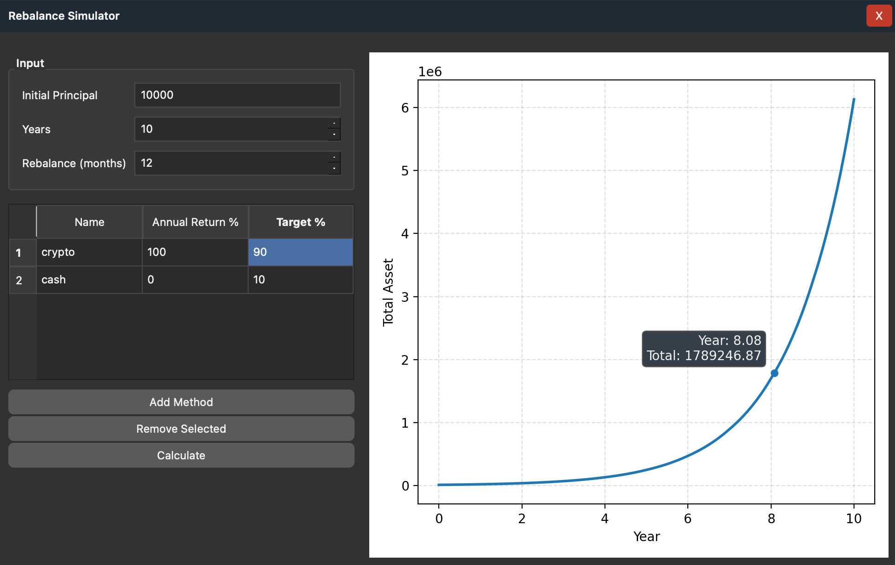

# Rebalance Simulator

A PySide6 desktop app that simulates portfolio growth with periodic rebalancing and displays results on an interactive chart.



## Features
- Multiple investment methods with custom annual return and target weight
- Rebalancing at a configurable month interval
- Configurable simulation horizon (years)
- Interactive chart with hover tooltip and point highlight
- Frameless draggable window
- Save current input settings to a local JSON file
- Automatically load saved settings on next launch

## Requirements
- Python 3.9+
- Dependencies listed in `requirements.txt`

## Install
Install dependencies with the same Python interpreter used to run the app.

```bash
python -m pip install -r requirements.txt
```

## Run
Run from the project root:

```bash
python main.py
```

## How To Use
1. Enter `Initial Principal`.
2. Set `Years` and `Rebalance (months)`.
3. Enter `Contribution per Rebalance` if needed.
4. Add, edit, or remove investment methods in the table.
5. Ensure total `Target %` is exactly `100`.
6. Click `Calculate` to refresh the chart.
7. Click `Save Settings` to persist all current inputs.
8. Restart the app to load saved settings automatically.

## Settings Persistence
- Settings are saved to `rebalance_settings.json` in the project root.
- Saved fields include:
  - Principal
  - Years
  - Rebalance interval
  - Contribution per rebalance
  - Investment methods table (name, annual return, target weight)
- If the settings file is missing or invalid, the app falls back to default rows.

## Notes
- Annual return is treated as a fixed rate and compounded monthly.
- Rebalancing resets holdings to target weights at each rebalance interval.
